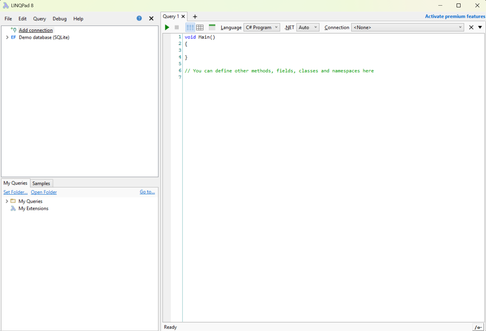

# [2] Setting things up

## Installing .NET

As mentioned in the previous section, we need a copy of .NET on our machines in
order to run our C# programs. Lets get that installed now.

1. Browse to the site https://dotnet.microsoft.com/en-us/download and download
.NET 9.

2. You may be prompted by your browser to run the download, if not open your
file explorer program and find your `Downloads` folder. Double click the file
you downloaded to start installation.

3. ???

## LinqPad

To started, we will be using a program called LinqPad to write our C# programs
with. This is a free tool that is used for writing short pieces of C# code, and
is an easy way to start learning about C#. Later in the course we will install a
fully fledged IDE called Visual Studio, that allows us to write much more
complex programs.

1. Browse to the site https://www.linqpad.net/Download.aspx and download
LinqPad 8.

2. ou may be prompted by your browser to run the download, if not open your
file explorer program and find your `Downloads` folder. Double click the file
you downloaded to start installation.

3. ???

### Configuration

1. Start the LinqPad program by clicking on the desktop or start menu item the
installer created.

2. On the `Edit->Preference` menu select the `General` tab. On there check the
box for the `Show line numbers in editor` option.

3. Select the `Query` tab. On there pick the value `C# Program` for the
`Default Query Language` option.

4. Click the `OK` button.

You should now be greeted by a screen like this:

### Finding your way around

???

